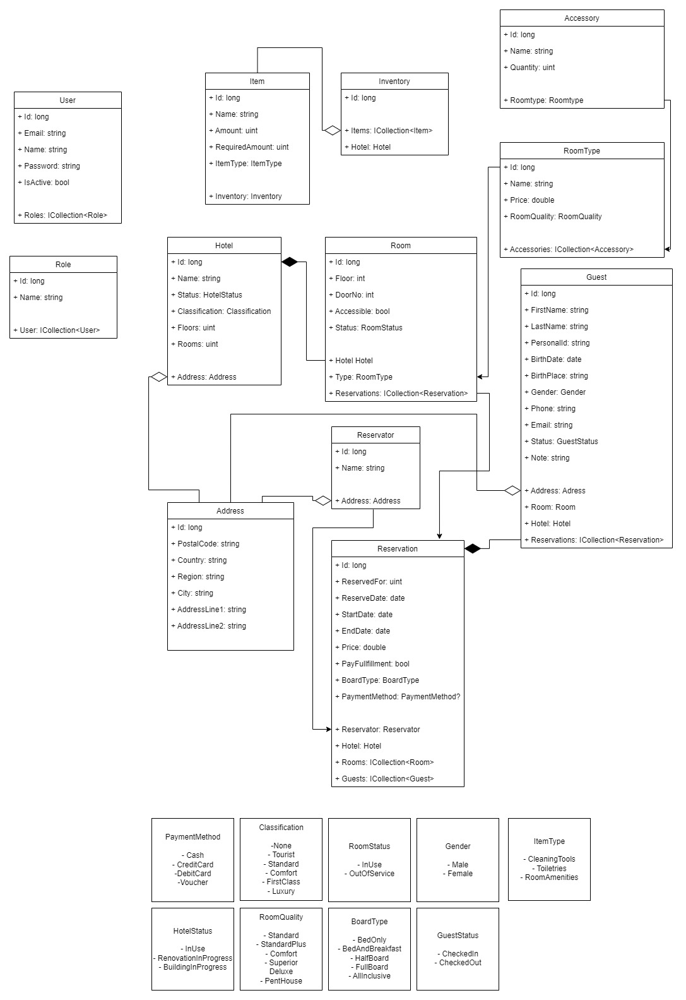

# Grande Hotel Management System
## What is our application about?
Our application aims to help those who work in the tourism sector with the management of their real estates, in our case hotels. 
The applicaction is divided into separate modules that are the different building blocks of the system 
but that are related and in most cases work in collaboration with each other to represent a complex hotel management system. 
These modules at the current time include Hotels, Rooms, Guests, Reservations and Inventory, but can be extended on demand of the user at any time. 

## What are the main features and technologies used in ths project? 
The technologies and features that we have incorporated in this application include:  
- ASP.NET backend with different endpoints and services
- PostgreSQL database with persistent data and connected tables
- React frontend with routing and clean UI made with MaterialUI components
- Entity Framework as an ORM tool
- Authentication and Authorization implemented both on backend and frontend 
- Management and permissions of different users based on their roles   
- Dockerized backend and frontend
- Workflows for GitHub actions that also run tests for backend services on each pull request

## How to run this application?
....

## Pictures
##### The model classes
  